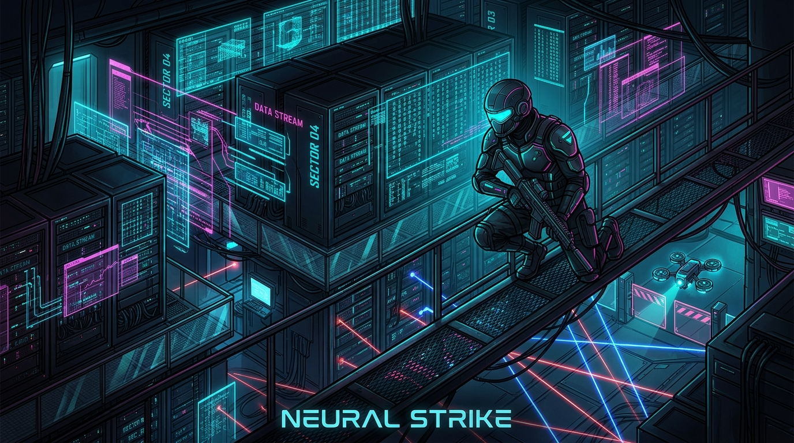

# ⚡ GridBreak: Operator Signal (Neuro-Cyber Edition)



[](https://developer.mozilla.org/en-US/docs/Web/API/Canvas_API)
[](https://developer.mozilla.org/en-US/docs/Web/API/Web_Audio_API)
[](https://developer.mozilla.org/en-US/docs/Web/API/SpeechSynthesis)
[](LICENSE)
[-blueviolet.svg?style=for-the-badge)](index.html)

> **Tactical Top-Down Cyberpunk Stealth Operations &amp; Cyberdeck Matrix Infiltration**  
> Infiltrate classified corporate black-sites, evade sweeping CCTV spotlights and heavy enforcer patrols, disarm laser security grids, breach terminal buffers, and extract sensitive neural payloads.

---

## 🎮 What Makes GridBreak Unique for Hackathons?

1. **Realistic Tiered Alarm Engine &amp; Raytraced Line-of-Sight**:
   - `0% – 20%` **SECURE**: Standard patrol sweeps.
   - `20% – 55%` **CAUTION [?]**: Enforcers investigate noise/peripheral glances, turning to face disturbances for 2.5s.
   - `55% – 99%` **INTRUSION ALERT [!]**: Visual lock confirmed; enforcers pursue in real-time, sirens sound, and red vignette pulses.
   - `100%` **FACILITY LOCKDOWN**: Sentry turrets saturate the sector.
2. **Interactive Cyberdeck Matrix Minigame**:
   - Hack terminals using a Cyberpunk-style hex matrix sequence matcher (`1C`, `E9`, `7A`, `BD`, `55`) to subvert security turrets, overload CCTV optics, and siphon crypto-credits!
3. **Sandevistan Reflex Overclock (`Q`)**:
   - Slows down world physics and enemy movements to **25% speed** while the operative remains nimble with glowing electric afterimages.
4. **Holographic Sonic Decoy (`F`)**:
   - Projects a holographic clone that lures sentry attention and security cameras away from critical keycard doors.
5. **3 Cyberware Archetypes**:
   - **Spectre (Netrunner)**: High max energy, fast regen, extended optical camouflage.
   - **Chronos (Infiltrator)**: Sandevistan time-dilation boost, rapid dash recharge.
   - **Wraith (Saboteur)**: Free sonic decoy lures, +50% EMP stun radius, remote node breaches.
6. **Endless Heist Mode**:
   - Infinite procedural floor generation with scaling guards, rogue combat turrets, and randomized keycard configurations.
7. **Procedural Multi-Channel Web Audio &amp; Cyber Radio Voice**:
   - Dynamic synthwave OST with ambient arpeggios that adapt from chill infiltration to high-octane chase beats.
   - Integrated synthetic radio voice handler providing live tactical comms.

---

## 🕹️ Controls Guide

| Action | Key / Control | Ability Cost |
|---|---|---|
| **Move Operative** | `W`, `A`, `S`, `D` or `Arrow Keys` | — |
| **Tactical Dash** | `Spacebar` | 1.8s Cooldown |
| **Reflex Overclock (Slow-Mo)** | `Q` Key / Button `[Q]` | 6.0s Cooldown |
| **Sonic Decoy Projection** | `F` Key / Button `[F]` | ⚡ 2 NRG (Free on Wraith) |
| **EMP Stun** | `1` Key / Button `[1]` | ⚡ 3 NRG |
| **Jam CCTV Optics** | `2` Key / Button `[2]` | ⚡ 2 NRG |
| **Bypass Laser Gate** | `3` Key / Button `[3]` | ⚡ 5 NRG |
| **Stealth Optical Cloak** | `4` Key / Button `[4]` | ⚡ 4 NRG |
| **Interact / Cyberdeck Hack** | `E` Key / Proximity | — |
| **Audio Toggle** | `🔊 AUDIO ON/OFF` | Header |
| **Synth OST Toggle** | `🎵 SYNTH ON/OFF` | Header |
| **Voice Radio Toggle** | `🎙️ RADIO ON/OFF` | Header |
| **Scanline CRT FX** | `⚡ CRT FX` | Header |

---

## 🗺️ Campaign Sectors

- **Sector 01**: `Perimeter Breach` — Auxiliary power room and keycard security basics.
- **Sector 02**: `Surveillance Array` — Sweeping camera networks and synchronized patrols.
- **Sector 03**: `Enforcer Intercept` — Multi-guard corridors and automated laser turrets.
- **Sector 04**: `The Core Vault` — Central 360-degree rotating scanner turret and inner sanctum keycards.
- **Sector 05**: `Neural Apex Core` — Extreme security matrix safeguarding the Sentient AI payload.
- **Endless Mode**: `♾️ Endless Heist` — Procedural infinite subterranean data vaults.

---

## 🚀 Quick Start (Local)

GridBreak runs 100% in any modern browser without any external build steps or dependencies:

```bash
# Option 1: Double-click index.html in file explorer

# Option 2: Run with local python web server
python -m http.server 8085
```

Navigate to `http://localhost:8085` and commence infiltration!

---

## 🌐 Deploy to GitHub Pages

1. Push this repository to your GitHub account:
```bash
git add .
git commit -m "feat: complete GridBreak Neuro-Cyber Edition"
git remote add origin https://github.com/<YOUR-USERNAME>/gridbreak-game.git
git branch -M main
git push -u origin main
```
2. In GitHub, go to **Settings** ➔ **Pages** ➔ Set Source to `Deploy from a branch` (Branch: `main`, Folder: `/ (root)`).
3. Your game is now live on `https://<YOUR-USERNAME>.github.io/gridbreak-game/`!

---

## 🏆 License

MIT License &copy; 2026 GridBreak Project. Built with pure HTML5, CSS3, and JavaScript.
